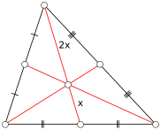
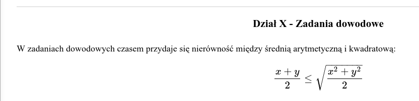
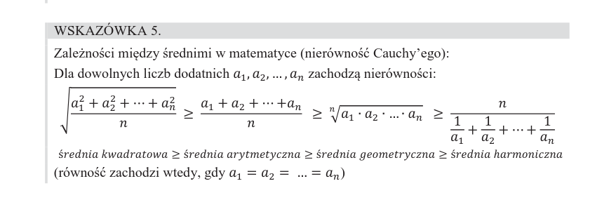

## środkowa trójkąta

środkowe trójkąta dzielą się na x i 2x

### płaszczyzna kartezjańska

oś odciętych - to oś x-ów

oś rzędnych - to oś y-ów

p= (x1 + x2 )/2

## geometria

x = (a+b)/2

### dowody

### Zależności między średnimi

##### Sources:
https://www.matemaks.pl/matura-najwazniejsze-wzory-spoza-tablic.html
https://pazdro.com.pl/web/uploads/files/MPW_strony_m.pdf

<link rel="stylesheet" href="https://cdn.simplecss.org/simple.min.css">
