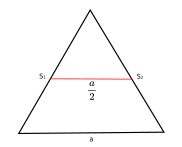
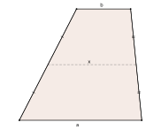
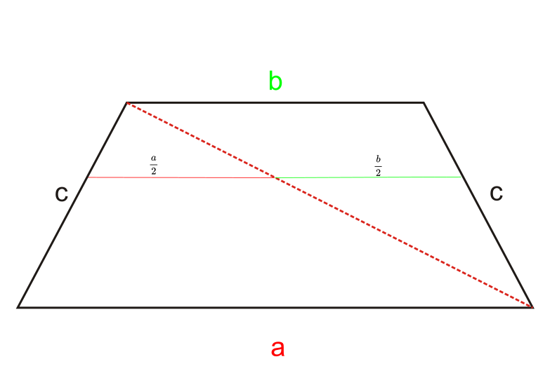
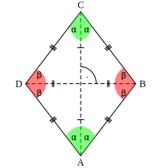

### Dowolny Trójkąt

środkowe trójkąta dzielą się na x i 2x

odcinek łączący środki boków trójkąta wynosi $\frac{a}{2}$

### Trapez

$$ x = \frac{a+b}2 $$

wytłumaczenie: robimy z trapeza 2 trójkąty, dzięki temu wiemy jaka jest długość środkowej trapezu

### Romb

### Dowodzenie

$$ \sqrt{\frac{a^2 + b^2}{2}} \geq \frac{a + b}{2} \geq \sqrt{a * b} $$

średnia kwadratowa $\geq$ średnia artytmetyczna $\geq$ średnia geometryczna

### Płaszczyzna kartezjańska

oś odciętych - to oś x-ów

oś rzędnych - to oś y-ów

wierzchołek p:

$$ p = \frac{x_1 + x_2}{2} $$

##### Sources:
- <https://en.wikipedia.org/wiki/Centroid>
- <https://pl.wikipedia.org/wiki/Trapez>
- <https://en.wikipedia.org/wiki/Trapezoid>
- <https://en.wikipedia.org/wiki/Rhombus>

<link rel="stylesheet" href="https://cdn.simplecss.org/simple.min.css">

<link rel="stylesheet" href="https://cdn.jsdelivr.net/npm/katex@0.16.4/dist/katex.min.css" integrity="sha384-vKruj+a13U8yHIkAyGgK1J3ArTLzrFGBbBc0tDp4ad/EyewESeXE/Iv67Aj8gKZ0" crossorigin="anonymous">

